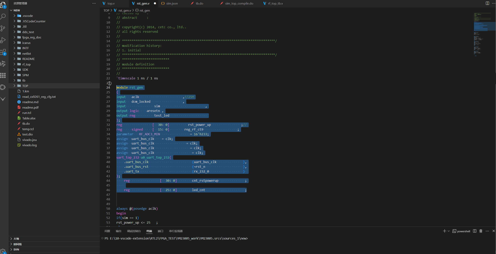
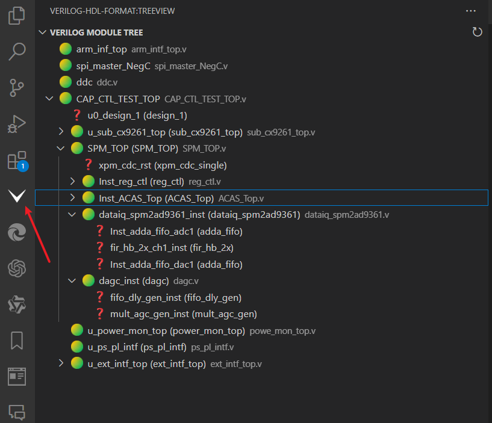
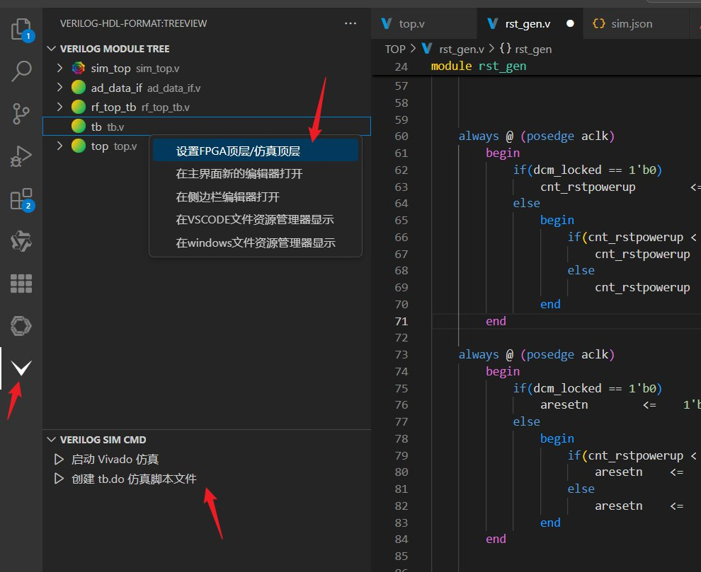
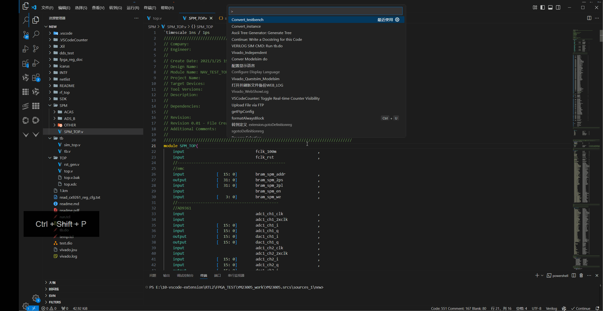
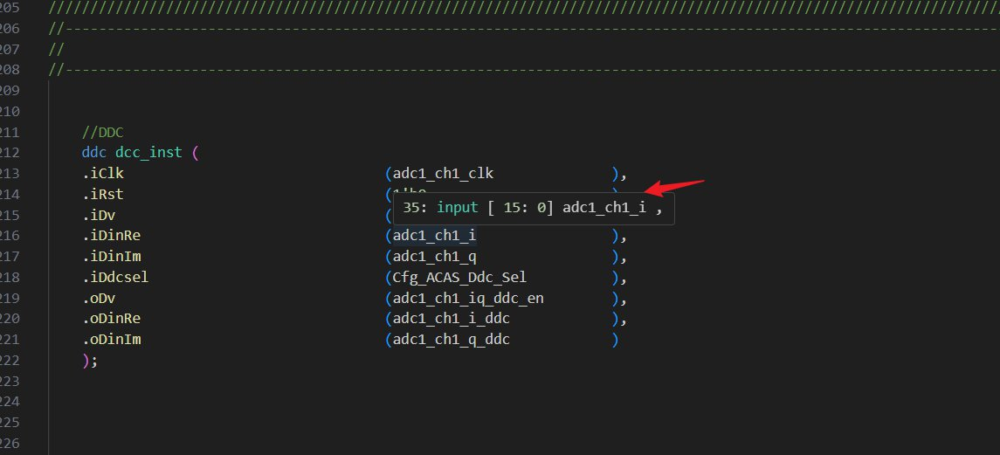
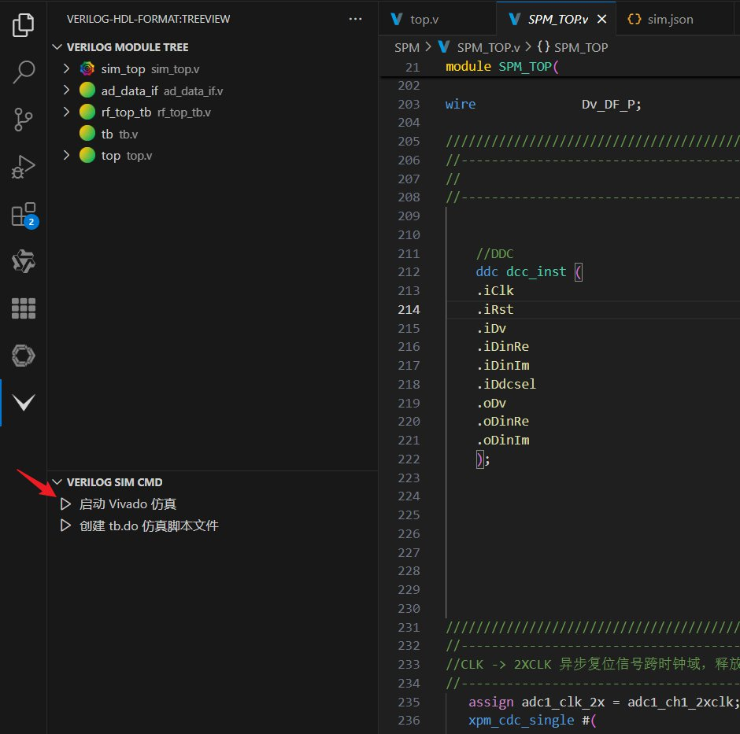
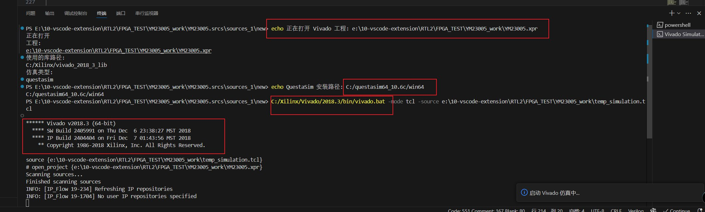
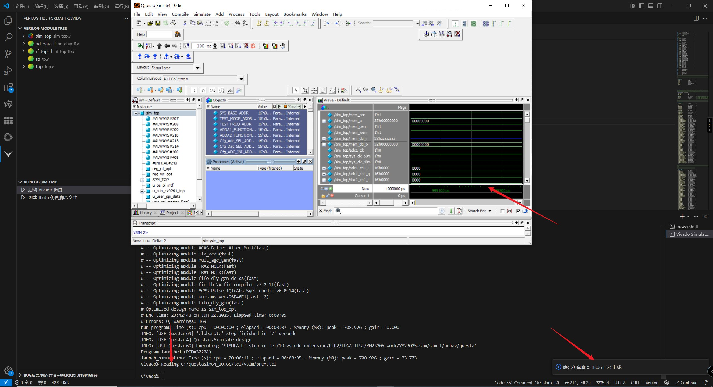
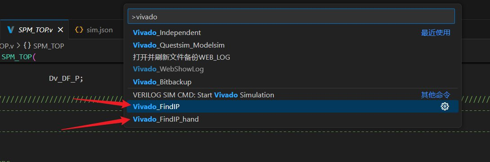
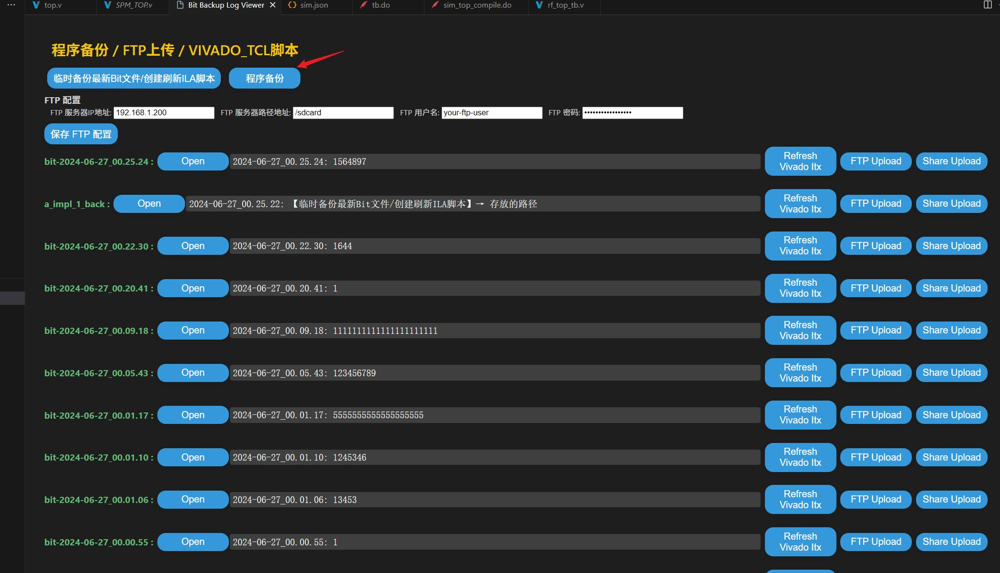

# ✨ Verilog-HDL-Format：提升 Verilog、VHDL、systemverilog 代码质量的 VSCode 插件

## 🌟 前言

欢迎使用 **verilog-hdl-format** 插件！这款强大的 VSCode 插件旨在帮助你提高 Verilog HDL 代码的编写效率和代码质量。它提供了代码格式化、文件树浏览、一键例化等一系列实用功能，让你的 Verilog 开发更加高效便捷。

📢 **您的反馈至关重要！** 如果你有任何建议或在使用过程中遇到问题，请随时通过以下方式与我联系：

*   **QQ:** 1391074994
*   **QQ 群:** 819816965

💖 如果你觉得这个插件对你有帮助，请不要吝啬你的好评，非常感谢！

### ⚠️ 注意：下面的视频链接暂时未更新！！最新功能请查看本页面下面的简介文档！！！
### 🎬 操作范例

*   **Bilibili 视频演示:** [点击观看](https://www.bilibili.com/video/BV1xi421d7e9/?vd_source=99e34f775e17481ae5a0ed7fad6b00cc#reply1451507881) 讲解版本：0.0.9.20240308[如果不是最新版本可能会存在差异]

### 📚 演示文档-注意：

*   **中文文档:** [查看中文文档](https://1391074994.github.io/Verilog-Hdl-Format/)
### 💾 仓库地址

*   **GitHub 仓库:** [verilog-hdl-format](https://github.com/1391074994/verilog-hdl-format)

### ⚙️ VSCode 版本要求

*   **VSCode 版本:** >= 1.74.3

## 🚀 主要功能概览

*   **代码格式化:**  自动对齐 Verilog 代码的变量、逗号和括号，使代码更易读。
*   **文件树显示:**  以树状结构清晰地展示 Verilog/VHDL/SystemVerilog 文件的层次关系，方便代码导航。
*   **一键例化:**  快速生成 Verilog 模块例化代码，并自动复制到剪贴板，告别繁琐的手动编写。
*   **语法高亮:** 支持 ucf, xdc, do, tcl, Verilog, SystemVerilog, VHDL 和高云 .cst 语法高亮显示，提升代码可读性。
*   **语法跳转:**  快速跳转到模块定义、引脚定义和变量定义，提高代码阅读和调试效率 (集成 CTAGS)。
*   **代码补全:**  提供智能的 Verilog 代码补全建议，减少代码输入量。
*   **定义悬停:**  鼠标悬停在变量或模块名上即可查看其定义信息 (集成 CTAGS)。
*   **语法检查:**  使用 xvlog 进行 Verilog 语法错误检查，及早发现并修复潜在问题。
*   **VIVADO 联合仿真:**  简化在 VSCode 中进行 VIVADO 联合仿真的流程 (Modelsim/QuestaSim)。
*   **VIVADO 程序备份和自动下载:**  备份 VIVADO 工程的 bit 文件，并提供自动下载脚本，保障项目安全。
*   **Vivado 仿真文件快速转换:**  转换 Vivado 仿真文件格式，方便不同工具之间的切换。
*   **FTP 功能:**  方便地将 bit 文件上传到 FTP 服务器，实现远程部署。
*   **UCF 转 XDC 文件:**  将 UCF 文件转换为 XDC 文件，方便进行约束文件的迁移。
*   **数字递增/递减:**  快速递增或递减选中的数字，提高编辑效率。
*   **颜色主题:** 提供自定义的 Verilog 颜色主题 ("jiang percy verilog themes")，个性化你的开发环境。

[TOC]


## 🛠 功能详解

### 🎨 代码格式化

1.  **功能简述:** 使用 `formatSelection` 命令格式化 Verilog 代码 (变量对齐、逗号对齐、括号对齐)。
2.  **命令:**
    *   🔵 **【代码格式化】** 命令: `formatSelection`  快捷键: `CTRL + L`
    *   🔵 **【ALWAYS 块格式化】** 命令: `formatAlwaysBlock` 快捷键: `CTRL + U`
3.  **设置:**
    * 注意点1. `配置下面的格式化num值之后如果不生效清重启VSCODE！！！！！！！！！！ ` 
    * 注意点2. `配置的num值不是空格数绝对值，而是包含了关键字的长度，如果存在少的关键字的行则空格数可能比你设置的更长，此为正常现象，需要满足最长的格式化设置！！！！！！！！！！ ` 
    * 格式化功能识别的主要逻辑：
        * 1. 端口写法： ` /^\s*(input|output|inout)\s*(reg|wire|logic)?\s*(signed)?\s*(\[.*\])?\s*([^;]*\b)\s*(,|;|\)\s*;)?.*$/ `
        * 2. 定义变量写法 ：`/^\s*(reg|wire|integer|logic)\s*(signed)?\s*(\[.*\])?\s*(\S+)\s*(\[.*\])?\s*(\S+)?\s*(?:\s+(.*))?;.*$/,`
        * 3. localparam|parameter : `/^\s*(localparam|parameter)\s*(\[.*\])?\s*(\w+)\s*=\s*([^,;]+)\s*(,|;)?/`
        * 4. assign : `/^\s*assign\s*(.*?)\s*=\s*(.*?);\s*.?$/`

    *   🔵 `Simple Align: Num1` 到 `Simple Align: Num17`:  分别对应代码格式化时不同部分的空格数量(包含前级关键字，不是绝对空格数)。
        *   例如，对于以下代码:
        
            对应的配置项含义如下：
            比如 ： /*[num2]*/ 等于 output reg signed + 空格数  ；  /*[num4]*/  等于 dac1_ch2_q + 后面的空格的长度 ；
            ```verilog
            /*[num1]*/  output reg signed /*[num2]*/ [  15: 0] /*[num3]*/  dac1_ch2_q  /*[num4]*/  ;
            /*[num5]*/  reg signed        /*[num6]*/ [  15: 0] /*[num7]*/  reg_rf_ct9  /*[num8]*/   ;   
            /*[num9]*/  parameter                              /*[num10]*/ RF_ADC3_MIN   = 16'h8233 /*[num11]*  ;
            /*[num12]*/ assign                                 /*[num13]*/ uart_bus_clk  = clk /*[num14]*/; 
            uart_top_232 u0_uart_top_232(
            /*[num15]*/ .uart_bus_clk                     /*[num16]*/  (uart_bus_clk    /*[num17]*/ ),  
            /*[num15]*/ .uart_bus_rst                     /*[num16]*/  (~rst_n          /*[num17]*/ ),  
            /*[num15]*/ .uart_tx                          /*[num16]*/  (rx_232_0        /*[num17]*/ )   
            );
            ```

    *   🔵 `simpleAlign.upbound` 和 `simpleAlign.lowbound` 为位宽 `[]` 内的空格数。
        *   例如:

            ```verilog
            output          [ /*[upbound]*/  7:/*[Lowbound]*/ 0]      uart_data_232_0        ,
            ```
    *   🔵 `Simple Align: Width_always`: `always` 代码行的缩进量。
    *   `always` 块的格式化适配两种格式:
        *   第一种: `always/if/else/else if` 后面有 `begin/end` (C 风格写法)
        *   第二种: `always/if/else/else if/begin/end` 单独成行的情况
4.  **gif/图片 演示:**
    

### 🌳 文件树显示

1.  **功能简述:** 支持 Verilog/VHDL/SystemVerilog 代码层次结构的文件树显示。
2.  **命令:**
    *   🔵 **【文件树显示】** 命令: `Refresh the verilog file tree display` 快捷键: 无
    *   在侧边栏编辑器打开
    *   在主界面新的编辑器打开
    *   在 Windows 文件资源管理器显示
    *   在 VSCode 文件资源管理器显示
    *   设置 FPGA 顶层/仿真顶层
3.  **设置:**
    *   🔵 `Verilog Module Finder: Exclude Folders`: Verilog 文件树的排除文件夹名称，可以自定义增加、删除需要匹配的文件夹名称。
        *   [排除 IP 或备份文件，使文件树的 TOP 层显示更干净，默认排除 `ip` 和 `core` 文件夹]
    *   🔵 触发和刷新 (容器右上角有刷新按钮/主编辑器区域鼠标右键也有命令)。
    *   🔵 支持 VHDL 和 Verilog SystemVerilog 的混合文件树显示。
4.  **gif/图片 演示:**

    * 
    * 

### ⚡ 一键例化

1.  **功能简述:** 一键生成例化/TB 代码，自动复制到剪贴板。
2.  **命令:**
    *   🔵 **【一键例化】** 命令: `Convert_instance` 快捷键: 无
    *   🔵 **【一键 TB】** 命令: `Convert_testbench` 快捷键: 无
3.  **设置:** 无
4.  **gif/图片 演示:**
    * 


### 🧭 语法跳转

1.  **功能简述:** 语法跳转功能，支持 Verilog/SystemVerilog 语法跳转，插件已集成 CTAGS，无需额外配置。
2.  **命令:**
    *   🔵 **【语法跳转 - 模块跳转】** 命令: `skip To Definition Module` 快捷键: 鼠标右键【转到例化模块】
    *   🔵 **【语法跳转 - PIN 跳转】** 命令: `skip To Definition Pin` 快捷键: 鼠标右键【转到例化 PIN 角】
    *   🔵 **【语法跳转 - 定义跳转】** 命令: `sgotoDefinitionreg` 快捷键: 鼠标右键【转到定义】
3.  **设置:** 无

### 🔍 语法检查

1.  **功能简述:** 语法错误检查功能，支持 Verilog/SystemVerilog 语法错误检查，推荐使用 `xvlog`。
2.  **命令:** 无
3.  **设置:**
    *   🔵 配置 `xvlog` 环境变量。
    *   🔵 `xvlog` 配置成功后，在 `cmd` 中执行 `xvlog -version` 查看是否配置成功。
    *   🔵 在设置界面配置 `FPGA_verilog › Linting: Linter` 选择 `xvlog`。

### 🌈 语法高亮

1.  **功能简述:** 支持 `ucf`, `xdc`, `do`, `tcl`, `verilog`, `sysverilog`, `vhdl` 语法高亮，高云 `.cst` 语法高亮。
2.  **命令:** 无
3.  **设置:** 无

### 💡 代码片段

1.  **功能简述:** 支持 Verilog/SystemVerilog 常用代码片段。
2.  **命令:** `module`, `tb`, `geli`, `separate`, `separate`, `separate`, `adder`, `subtractor`, `shangshenyan`, `zhuangtaiji`, `always`, `dapai`, `assign`, `alclk`, `alwaysposclk`, `alnegclk`, `alwaysnegclk`, `begin`, `end`, `initial`, `case`, `reg`, `regarray`, `reg`, `regmemory`, `memory`, `input`, `output`, `wire`, `wirearray`, `array`, `parameter`, `localparam`, `integer`, `signed`, `prefix`, `signed`, `include`, `include`, `def`, `define`, `define`, `ifdef`, `ifdef`, `ifndef`, `ifndef`, `elsif`, `elsif`, `endif`, `endif`, `undef`, `undef`, `default_nettype`, `default_nettype`, `ternary`, `if`, `ifelse`, `for`, `while`, `forever`, `function`, `generate`, `genvar`。
3.  **设置:** 无

### 🔎 定义悬停

1.  **功能简述:** 支持 Verilog/SystemVerilog 定义悬停，插件已集成 CTAGS，无需额外配置。
2.  **命令:** 无
3.  **设置:** `Hover: Switch` 可以配置悬停显示开关。
4.  **gif/图片 演示:**
    * 

### 🔢 数字递增/递减

1.  **功能简述:**  快速递增或递减选中的数字。
2.  **命令:**
    *   🔵 **[数字递增]** 命令: `Increment Selection` 快捷键: `CTRL + ALT + I`
    *   🔵 **[数字递减]** 命令: `Decrement Selection` 快捷键: `CTRL + ALT + U`
    *   🔵 **[反向选择]** 命令: `Reverse Selection` 快捷键: 无
3.  **设置:** `Increment.num`: 配置数字递增递减的步长。

### 🚀 VIVADO 联合仿真

1.  **功能简述:**  可以在 VSCode 中快速进行仿真。
2.  **命令:** `Vivado_Questsim_Modelsim` 快捷键: 无
3.  **设置:**
    *   🔵 `Vivado › Bat: Path`: 设置你的 VIVADO 的安装路径，默认值: `C:/Xilinx/Vivado/2018.3/bin/vivado.bat`
    *   🔵 `Vivado Library: Path`: 设置你的 VIVADO 联合仿真库路径，默认值: `C:/Xilinx/vivado_2018_3_lib`
    *   🔵 `Vivado Sim: Type`: 设置你的 VIVADO 联合仿真软件，可选 `'modelsim'` 或 `'questasim'`，默认值: `questasim`
    *   🔵 `Vivado Sim Path: Path`: 设置你的联合仿真软件安装路径，默认值: `C:/questasim64_10.6c/win64`
4.  **gif/图片 演示:**
    * 
    * 
    * 


    
### 📦 VIVADO 快速例化 IP

1.  **功能简述:** 可以在 VSCode 中快速例化 VIVADO 的 IP。
2.  **命令:**
    *   🔵 `Vivado_FindIP`: 例化最新的 VIVADO 里面新建的 IP 文件 快捷键: 无
    *   🔵 `Vivado_FindIP_hand`: 手动选择例化 VIVADO 里面的 IP 文件 快捷键: 无
4.  **gif/图片 演示:**
    * 


### 💾 VIVADO bit 程序备份(WEB 界面)

1.  **功能简述:** bit 程序备份。
2.  **命令:** `Vivado_Bitbackup` 快捷键: 无
3.  **设置:**
    *   🔵 通过 `Vivado_WebShowLog` 查看备份界面。
    *   🔵 WEB 界面还可以进行 FTP 文件上传。
    *   🔵 WEB 还可以自动生成下载 bit 程序和刷新 ILA 脚本，点击按钮后直接在 VIVADO 的 tcl 栏目黏贴既可运行备份的版本程序。
4.  **gif/图片 演示:**
    * 


### 🔄 文件转换

1.  **功能简述:** `ucf` 转 `xdc` 文件。
2.  **命令:** `Convert UCF to XDC SORT ORDER` 快捷键: 无
3.  **设置:** 无
4.  **gif/图片 演示:**
    * 

### 🌐 FTP 功能(WEB 界面)

1.  **功能简述:** FTP 功能，支持 VIVADO 的 BIT 文件上传到 FTP 服务器。
2.  **命令:**
    *   🔵 **【FTP 配置】** 命令: `getFtpConfig` 快捷键: 无
    *   🔵 **【FTP 上传】** 命令: `Upload File via FTP` 快捷键: 无
    *   🔵 **【FTP 下载】** 命令: `Download File via FTP` 快捷键: 无
3.  **设置:**  请查阅相关文档配置 FTP 服务器信息。

### 🎨 颜色主题

1.  **功能简述:** 常用颜色主题。
2.  **命令:**  在 VSCode 中选择主题。
3.  **设置:** 主题名称: 【jiang percy verilog themes】。

### 🌍 WEB 界面


## ⚙️ 设置界面配置介绍


```
配置位置：设置 → 扩展设置 → verilog-hdl-format插件设置 
```
1.  `Extension: Company Name`: 输入你的公司或组织名称，设置好之后在使用 TB, module 代码片段的时候会自动填入公司或组织名称。
2.  `Extension: User Name`: 输入你的作者名称，设置好之后在使用 TB, module 代码片段的时候会自动填入作者名称。
3.  `Extract Data: Custom Options`: modelsim 软件一键 do 文件合并之后定义需要加的指令。
4.  `FPGA_verilog` 开头的都是 [Verilog-HDL/SystemVerilog/Bluespec SystemVerilog](https://github.com/mshr-h/vscode-verilog-hdl-support) 的 linter (verilog 语法检测) 功能设置。如果需要进行语法检测，常见的设置 (也可以选择使用其他语法检测) 是设置 `FPGA_verilog › Linting: Linter`：设置为 `xvlog`，系统环境变量设置 vivado 的 xvlog 路径。
5.  【FPGA_verilog.ctags.path】/【FPGA_verilog.ctags.choose】:默认为内部集成 ctags, 需要使用可以在设置里面进行切换。可以实现语法定义跳转（支持跨文件）。

## 🙏 感谢

*   [verilog-simplealign](https://github.com/CENZONGJUN/verilog-simplealign)
*   [Verilog-HDL/SystemVerilog/Bluespec SystemVerilog](https://github.com/mshr-h/vscode-verilog-hdl-support)

