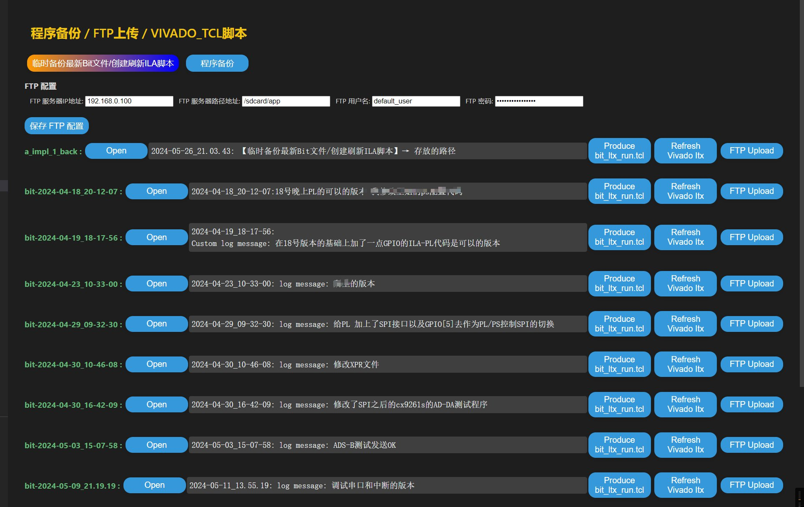

# verilog-hdl-format 插件介绍

## 前言

- 提升🟢:如果大家有好的修改意见,请给我留言. 🐧QQ:1391074994 🐧QQ裙: 819816965
- 如果好用,请记得给个好评😘😘😘.

* 操作范例:[【bilibi 示范链接】](https://www.bilibili.com/video/BV1xi421d7e9/?vd_source=99e34f775e17481ae5a0ed7fad6b00cc#reply1451507881)
* 演示文档链接:[【中文文档】](https://1391074994.github.io/Verilog-Hdl-Format/)    [【ENGLISH】](https://1391074994.github.io/Verilog-Hdl-Format/#/./README_en)
* github链接:[【verilog-hdl-format】](https://github.com/1391074994/verilog-hdl-format)
* VSCODE版本 >=【1.74.3】

## 功能简介

1. 语法功能

   * [代码格式化](./gsh/geshihua.md)
   * [文件树显示](./wjs/wenjianshu.md)
   * [一键例化](./lihua/lihua.md)
   * [语法高亮](./gl/gl.md)
   * [语法跳转](./yf/yf.md)
   * [代码补全](./bq/bq.md)
   * [定义悬停](./yf/yf.md)
   * [代码错误检查](./linter/linter.md)
2. 其他功能

   * [VIVADO联合仿真]()
   * [VIVADO程序备份和自动下载]()
   * [vivado仿真文件的快速转换](./sim_do/sim_do.md)
   * [FTP功能]()
   * [ucf转xdc文件](./ucf_to_xdc/ucf_to_xdc.md)
   * [游标列递增、递减](./incrementSelection/incrementSelection.md)
   * [颜色主题](./thems/thems.md)
3. 实现verilog代码格式化功能（变量对齐，逗号对齐，括号对齐）,在设置界面可以配置缩进量。功能触发：按下 ctrl+shift+p :输入 verilog。 快捷键 CTRL + L;功能2：加入只对于always块的格式化，在设置界面可以配置缩进量。命令：verilog-simplealign.always_valuation_func；快捷键ctrl + U。
4. 一键例化功能,例化的代码自动复制到剪切板。功能触发：按下 ctrl+shift+p :输入 Convert_instance。一键tb功能:按下 ctrl+shift+p :输入 Convert_testbench.
5. ucf转xdc文件:

   - 正常顺序转换。 功能触发：按下 ctrl+shift+p :输入 Convert UCF to XDC NORMAL ORDER。
   - 可实现序号的从小到大的排列。 功能触发：按下 ctrl+shift+p :输入 Convert UCF to XDC SORT ORDER。
6. 语法高功能：ucf,xdc,do,tcl语法高亮，verilog语法高亮，高云.cst语法高亮。
7. verilog代码常用片段。
8. verilog代码定义变量悬停显示。
9. 代码错误检查:加入[Verilog-HDL/SystemVerilog/Bluespec SystemVerilog](https://github.com/mshr-h/vscode-verilog-hdl-support)的linter(verilog语法检测).
10. vivado仿真文件的快速转换功能 :进入vivado 工程下的sim_1\behav\questa(或者modelsim)里面运行命令Conver Modelsim do 则会把 xxx_compile.do,xxx_elaborate.do,xxx_simulate.do和加入用户自定义配置文件生成一键运行的tb.do 文件.
11. incrementSelection的功能：使用多个游标进行递增、递减或反向选择
12. 加入了verilog 文件树显示功能.需要命令Refresh the verilog file tree display(中文：刷新verilog文件树显示)触发和刷新（容器右上角有刷新按钮/主编辑器区域鼠标右键也有命令）
13. 加入verilog定义跳转,例化名跳转,例化的端口跳转。快捷跳转需要ctags,（支持跨文件跳转）。
14. 加入了颜色主题- VSCODE 颜色主题：[jiang percy verilog themes]()
15. 读取VIVAD 的最新ip的Veo文件 ：就是IP的例化文件
16. 加入了bit文件备份功能,[第一次使用需要使用命令：Vivado_Bitbackup进行第一次的文件备份]()使用Bitbackup命令进行备份-管理界面后续可以使用命令 [Vivado_WebShowLog]() 进行刷新
17. 加入自动生成下载bit程序和刷新ILA脚本,使用ReFreShWbLog命令打开WEB界面,点击按钮后直接在VIVADO 的 tcl栏目黏贴既可运行备份的版本程序.
18. 加入了VIVADO和questasim/modelsim的联合仿真功能
19. 加入了FTP 功能，以及WEB界面的程序一键FTP上传功能

WEB界面:



* 代码片段:支持输入的代码片段:  | module | geli | jishuqi | shangshenyan | tb | zhuangtaiji | always | dapai | assign | alwaysposclk | alwaysnegclk | begin | end | initial | case | reg | regarray | regmemory | wire | wirearray | array | parameter | localparam | integer | signed | include | def | ifdef | ifndef | elsif | endif | undef | ts | default_nettype | ternary | if | ifelse | for | while | forever | function | generate |genvar
  其中 比较常用的部分:module/geli/jishuqi/shangshenyan/tb/zhuangtaiji/always/dapai

## 设置界面配置介绍

```
配置位置：设置 → 扩展设置 → verilog-hdl-format插件设置 
```

1. Extension: Company Name ： 输入你的公司或组织名称，设置好之后在使用TB,module代码片段的时候会自动填入公司或组织名称
2. Extension: User Name ： 输入你的作者名称，设置好之后在使用TB,module代码片段的时候会自动填入作者名称
3. Extract Data: Custom Options : modelsim软件一键do文件合并之后定义需要加的指令。
4. FPGA_verilog开头的都是 [Verilog-HDL/SystemVerilog/Bluespec SystemVerilog](https://github.com/mshr-h/vscode-verilog-hdl-support)的linter(verilog语法检测)功能设置。如果需要进行语法检测，常见的设置（也可以选择使用其他语法检测）是设置FPGA_verilog › Linting: Linter：设置为xvlog，系统环境变量设置vivado的xvlog路径。
5. Simple Align: **Num1** 到 Simple Align: **Num4** ：分别为 代码格式化的空格数量：
   例如原本代码为：

```verilog
      output     [   7: 0]   uart_data_232_0        ,
      reg        [  15: 0]   reg_rf_ct9             ;
      parameter              RF_ADC3_MIN            = 16'h8233;
      assign                 uart_bus_clk           = clk;
  // 例化
  uart_top_232 u0_uart_top_232(
      .uart_bus_clk          (uart_bus_clk     ),
      .uart_bus_rst          (~rst_n           ),
      .uart_tx               (rx_232_0         )
);
```

配置对应的位置：

```verilog
 /*[num1]*/  output    /*[num2]*/  [   7: 0]  /*[num3]*/  uart_data_232_0  /*[num4]*/          ,
 /*[num1]*/  reg       /*[num2]*/  [  15: 0]  /*[num3]*/  reg_rf_ct9       /*[num4]*/          ;
 /*[num1]*/  parameter                        /*[num3]*/  RF_ADC3_MIN      /*[num4]*/ = 16'h8233;
 /*[num1]*/  assign                           /*[num3]*/  uart_bus_clk     /*[num4]*/ = clk;
 // 例化
 uart_top_232 u0_uart_top_232(
 /*[num1]*/ .uart_bus_clk                     /*[num3]*/  (uart_bus_clk    /*[num4]*/ ),
 /*[num1]*/ .uart_bus_rst                     /*[num3]*/  (~rst_n          /*[num4]*/ ),
 /*[num1]*/ .uart_tx                          /*[num3]*/  (rx_232_0        /*[num4]*/ )
);


```

6. Simple Align › Num5: Upbound 和 Simple Align › Num6: Lowbound 为 位宽内的[ ]空格数。
   例如：

```verilog
output          [ /*[num5]*/  7:/*[num6]*/ 0]      uart_data_232_0        ,
```

7. Simple Align: Width_always ：是alway代码行的缩进量，
8. Simple Align: Width_always_valuation : 是alway内部赋值的缩进量，
9. Simple Align: Width_begin_end : 是begin/end的缩进量，
10. Simple Align: Width_else : 是else的缩进量，
11. Simple Align: Width_else_if : 是else if的缩进量，
12. Simple Align: Width_if : 是if的缩进量。
    例如：

```verilog
      [Width_always]          always @(posedge clk or negedge rst_n_power)                
      [Width_begin_end]             begin                                                              
      [Width_if]                          if(!rst_n_power)          
      [Width_always_valuation]                  F_POWER_EN_cnt <= 'd0   ;
      [Width_else_if]                     else if(F_BAT_SW==0)       
      [Width_always_valuation]                  F_POWER_EN_cnt <= F_POWER_EN_cnt + 1'b1;
      [Width_else]                        else
      [Width_always_valuation]                  F_POWER_EN_cnt <= 'd0  ;
      [Width_begin_end]             end
```

13. Verilog Module Finder: Exclude Folders ： verilog 文件树的排除文件夹名称，可以自定义增加，删除需要匹配的文件夹名称。[所打开的文件夹中屏蔽掉IP/或者一些备份文件的Verilog文件，使文件树的TOP层显示更加干净，默认是屏蔽（ip和core的文件夹）]()。
14. 【FPGA_verilog.ctags.path】/【FPGA_verilog.ctags.choose】:默认为内部集成ctags,需要使用可以在设置里面进行切换。可以实现语法定义跳转（支持跨文件）。

## 感谢

* [verilog-simplealign](https://github.com/CENZONGJUN/verilog-simplealign)
* [Verilog-HDL/SystemVerilog/Bluespec SystemVerilog](https://github.com/mshr-h/vscode-verilog-hdl-support)

# ENGLISH

# verilog-hdl-format README

## Preface

- Upgrading🟢: If you have any good suggestions for improvement, please leave me a message. 🐧QQ: 1391074994  🐧QQ group: 819816965
- If it works well, please remember to give a good review

* Example of operation: [bilibi demonstration link](https://www.bilibili.com/video/BV1xi421d7e9/?vd_source=99e34f775e17481ae5a0ed7fad6b00cc#reply1451507881)
* Demo document link: [Chinese document](https://1391074994.github.io/Verilog-Hdl-Format/)
* GitHub link: [verilog-hdl-format](https://github.com/1391074994/verilog-hdl-format)

## Function Introduction

1. Grammar function
   * [Code Formatting](./en/gsh/geshihua.md)
   * [Displaying the file tree](./en/wjs/wenjianshu.md)
   * [One-click instantiation](./en/lihua/lihua.md)
   * [Syntax highlighting](./en/gl/gl.md)
   * [Syntax Jump](./en/yf/yf.md)
   * [Code completion](./en/bq/bq.md)
   * [Define hover](./en/yf/yf.md)
   * [Code Error Checking](./en/linter/linter.md)
2. Other functions
   * [ucf to xdc file](./zh-ch/ucf_to_xdc/ucf_to_xdc.md)
   * [Fast conversion of Vivado simulation files](./en/sim_do/sim_do.md)
   * [Incrementing and Decrementing a Cursor Column](./en/incrementSelection/incrementSelection.md)
   * [Color Theme](./en/thems/thems.md)

## Function Introduction

1. Implement verilog code formatting features (variable alignment, comma alignment, bracket alignment), and configure the indentation amount in the settings interface. Function trigger: press Ctrl+Shift+P: enter verilog. Shortcut key CTRL + L; Function 2: add formatting only for always blocks, and configure the indentation amount in the settings interface. Command: verilog-simplealign.always_valuation_func; Shortcut key CTRL + U.
2. One-click instantiation function, the instantiated code is automatically copied to the clipboard. Function trigger: press Ctrl+Shift+P: enter Convert_instance. One-click tb function: press Ctrl+Shift+P: enter Convert_testbench
3. ucf to xdc file:
   3.1 Normal order conversion. Function trigger: Press Ctrl+Shift+P: Enter Convert UCF to XDC NORMAL ORDER.
   3.2 It can achieve the sequence number from small to large. Function trigger: Press Ctrl+Shift+P: Enter Convert UCF to XDC SORT ORDER.
4. High-function syntax highlighting: ucf, xdc, do, tcl syntax highlighting, verilog syntax highlighting, high cloud.cst syntax highlighting.
5. Common fragments of verilog code.
6. Define variable hover display in verilog code.
7. Code error checking: added the linter (verilog syntax detection) of [Verilog-HDL/SystemVerilog/Bluespec SystemVerilog](https://github.com/mshr-h/vscode-verilog-hdl-support)
8. Quick conversion function of Vivado simulation file: Enter the sim_1\behav\questa (or modelsim) folder under the Vivado project and run the command Conver Modelsim do, which will generate the xxx_compile.do, xxx_elaborate.do, xxx_simulate.do and a user-defined configuration file to generate a one-click run tb.do file
9. The function of incrementSelection: using multiple cursors to perform incremental, decremental, or reverse selection
10. Added the verilog file tree display function. The command Refresh the verilog file tree display is required to trigger and refresh (there is a refresh button in the upper right corner of the container/right-click on the main editor area for commands)
11. Add verilog definition jumps, instantiation name jumps, and instantiation port jumps. Quick jumps require ctags (supporting cross-file jumps).
12. Added color theme - VSCODE color theme: [jiang percy verilog themes]()

* Example of operation: [bilibi demonstration link](https://www.bilibili.com/video/BV1xi421d7e9/?vd_source=99e34f775e17481ae5a0ed7fad6b00cc#reply1451507881)
* Demo document link: [CSDN Demo Document Link](https://blog.csdn.net/weixin_44830487/article/details/133364935?csdn_share_tail=%7B%22type%22%3A%22blog%22%2C%22rType%22%3A%22article%22%2C%22rId%22%3A%22133364935%22%2C%22source%22%3A%22weixin_44830487%22%7D)
* Code snippet: Supported code snippets:  | module | geli | jishuqi | shangshenyan | tb | zhuangtaiji | always | dapai | assign | alwaysposclk | alwaysnegclk | begin | end | initial | case | reg | regarray | regmemory | wire | wirearray | array | parameter | localparam | integer | signed | include | def | ifdef | ifnf | elsif | else if | else | undef | ts | default_nettype | ternary | if | ifelse | for | while | forever | function | generate |genvar
  Among them, the more commonly used ones are: module/geli/jishuqi/shangshenyan/tb/zhuangtaiji/always/dapai

## Introduction to Setting Interface Configuration

```
Configuration location: Settings → Extensions Settings → verilog-hdl-format plugin settings
```

1. Extension: Company Name: Enter your company or organization name, and it will be automatically filled in when using the TB, module code snippet after setting it up
2. Extension: User Name: Enter your author name, and it will be automatically filled in when using the TB, module code snippet after setting it up
3. Extract Data: Custom Options: Define the instructions to add after the modelsim software merges the do files with one click.
4. The FPGA_verilog header is set by the linter (verilog syntax detection) function of [Verilog-HDL/SystemVerilog/Bluespec SystemVerilog](https://github.com/mshr-h/vscode-verilog-hdl-support). If syntax detection is required, the common setting (other syntax detectors can also be selected) is to set FPGA_verilog › Linting: Linter: to xvlog, and the system environment variable is set to the xvlog path of Vivado.
5. Simple Align: **Num1** to Simple Align: **Num4**: The number of spaces for code formatting, respectively:
   For example, the original code is:

```verilog
      output     [   7: 0]   uart_data_232_0        ,
      reg        [  15: 0]   reg_rf_ct9             ;
      parameter              RF_ADC3_MIN            = 16'h8233;
      assign                 uart_bus_clk           = clk;
  // instantiate
  uart_top_232 u0_uart_top_232(
      .uart_bus_clk          (uart_bus_clk     ),
      .uart_bus_rst          (~rst_n           ),
      .uart_tx               (rx_232_0         )
);
```

Configure the corresponding position:

```verilog
 /*[num1]*/  output    /*[num2]*/  [   7: 0]  /*[num3]*/  uart_data_232_0  /*[num4]*/          ,
 /*[num1]*/  reg       /*[num2]*/  [  15: 0]  /*[num3]*/  reg_rf_ct9       /*[num4]*/          ;
 /*[num1]*/  parameter                        /*[num3]*/  RF_ADC3_MIN      /*[num4]*/ = 16'h8233;
 /*[num1]*/  assign                           /*[num3]*/  uart_bus_clk     /*[num4]*/ = clk;
 // instantiate
 uart_top_232 u0_uart_top_232(
 /*[num1]*/ .uart_bus_clk                     /*[num3]*/  (uart_bus_clk    /*[num4]*/ ),
 /*[num1]*/ .uart_bus_rst                     /*[num3]*/  (~rst_n          /*[num4]*/ ),
 /*[num1]*/ .uart_tx                          /*[num3]*/  (rx_232_0        /*[num4]*/ )
);


```

6. Simple Align › Num5: Upbound and Simple Align › Num6: Lowbound are the number of [ ] spaces within the bit width.
   For example:

```verilog
output          [ /*[num5]*/  7:/*[num6]*/ 0]      uart_data_232_0        ,
```

7. Simple Align: Width_always: is the indentation amount of the always code line,
8. Simple Align: Width_always_valuation: is the amount of indentation for always internal assignment,
9. Simple Align: Width_begin_end: is the amount of indentation for begin/end,
10. Simple Align: Width_else: is the indentation of else,
11. Simple Align: Width_else_if: is the indentation amount of else if,
12. Simple Align: Width_if: is the indentation amount of if.
    For example:

```verilog
      [Width_always]          always @(posedge clk or negedge rst_n_power)                
      [Width_begin_end]             begin                                                              
      [Width_if]                          if(!rst_n_power)          
      [Width_always_valuation]                  F_POWER_EN_cnt <= 'd0   ;
      [Width_else_if]                     else if(F_BAT_SW==0)       
      [Width_always_valuation]                  F_POWER_EN_cnt <= F_POWER_EN_cnt + 1'b1;
      [Width_else]                        else
      [Width_always_valuation]                  F_POWER_EN_cnt <= 'd0  ;
      [Width_begin_end]             end
```

13. Verilog Module Finder: Exclude Folders: The excluded folder names of the verilog file tree can be customized and added. Deleting the required matching folder names is also supported. [The Verilog files in the IP/ or backup files are screened out from the opened folder, making the top layer of the file tree display cleaner. The default is to screen out (ip and core folders).] ().
14. FPGA_verilog.ctags.path: the path to the external environment ctags is required. It can implement syntax definition jump (supporting cross-file).

## Thank you

* [verilog-simplealign](https://github.com/CENZONGJUN/verilog-simplealign)
* [Verilog-HDL/SystemVerilog/Bluespec SystemVerilog](https://github.com/mshr-h/vscode-verilog-hdl-support)
