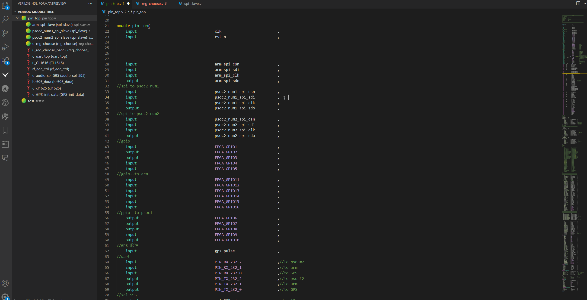

# Code formatting

## Function description

- Implement verilog code detection - Configure an external detection environment - xvlog is recommended

## Configuration method
1. Configure the xvlog environment variable
2. xvlog is successfully configured You can run the xvlog -version command in cmd to check whether the configuration is successful
3. Configure FPGA_verilog › Linting: Linter Select xvlog

## Demo
- 