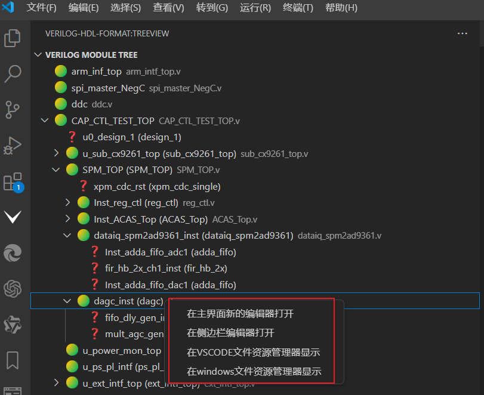

# Display the file tree
## Function Description
 - A file tree display that can be instantiated with verilog code can be implemented, similar to the hierarchical structure display of Vivado.
 - The file tree is displayed as shown in the figure:

 
### Built-in commands in the file tree
   - 
   - Open the sidebar editor
   - Open a new editor in the main interface
   - Display in windows file explorer
   - Display in VSCODE file explorer
### User Settings
- Verilog Module Finder: Exclude Folders:
   The exclude folder name of the verilog file tree can be customized to add or delete matching folder names. The Verilog files in the IP/ or backup files are blocked in the opened folder, making the top layer of the file tree display cleaner. The default is to block the ip and core folders.
- Tree: Indent: file tree indentation
   The default indent is 8 spaces, but you can customize it. We recommend using 15 spaces.
  