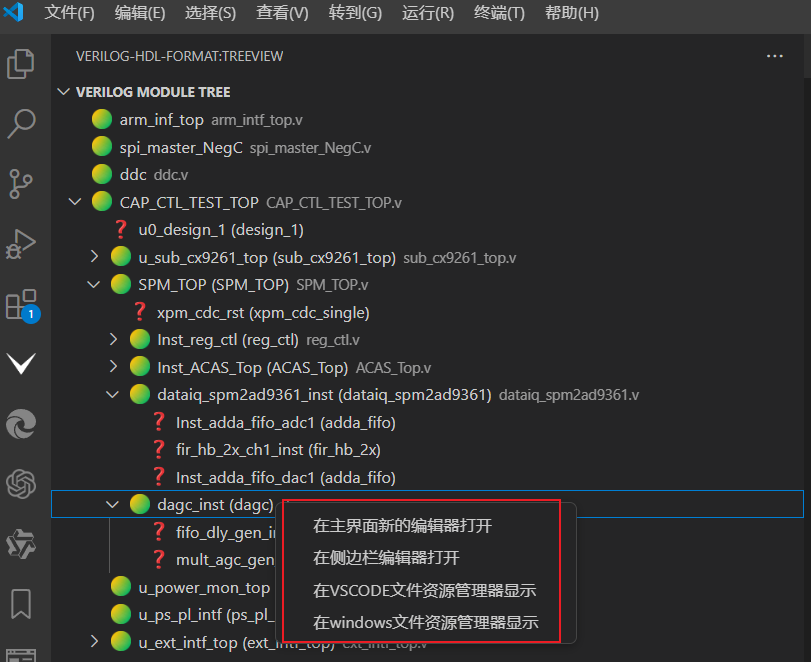

# 文件树显示
## 功能描述
 - 可以实现verilog代码例化的文件树显示-类似于VIVADO的层次结构显示。
 - 文件树显示如图：

 
### 文件树内置命令
   - 
   - 在侧边栏编辑器打开 
   - 在主界面新的编辑器打开
   - 在windows文件资源管理器显示
   - 在VSCODE文件资源管理器显示
### 用户设置
- Verilog Module Finder: Exclude Folders ：
   - verilog 文件树的排除文件夹名称，可以自定义增加，删除需要匹配的文件夹名称。所打开的文件夹中屏蔽掉IP/或者一些备份文件的Verilog文件，使文件树的TOP层显示更加干净，默认是屏蔽（ip和core的文件夹）。
- Tree: Indent: 文件树缩进
   - 默认缩进为8个空格，可以自定义缩进,推荐使用15个空格。
  