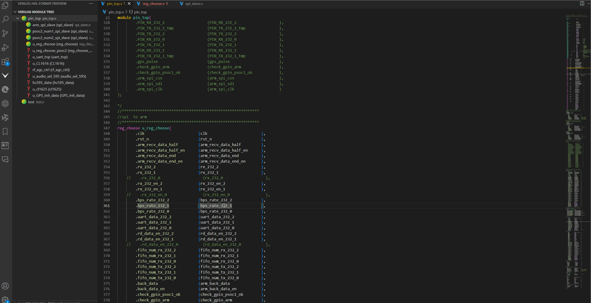
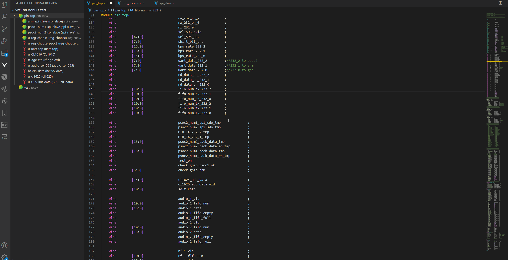

# 语法跳转和定义悬停
## ctags 配置

- 由于定义快捷跳转需要使用ctags，所以需要配置ctags。

- 不配置ctags，则快捷跳转功能将无法使用。但是可以使用命令进行跳转。

1. 推荐下载ctags到c盘

2. 配置ctags.exe到环境变量

    - 当配置成功之后：powershell:输入 ctags -version 可以查看ctags安装成以及版本信息

3. 配置ctags.exe到vscode-设置里面配置:ctags：例如C:\ctags-2023-06-08_p6.0.20230604.0-1-g89081cc-x64\ctags.exe

## 功能

1. verilog定义跳转

2. verilog例化名跳转

3. verilog例化的端口跳转    

### 功能演示：
- 使用命令进行语法跳转(不需要ctags)

- 

- 使用快捷键(ctrl+鼠标左键)进行语法跳转(需要ctags环境)

- 